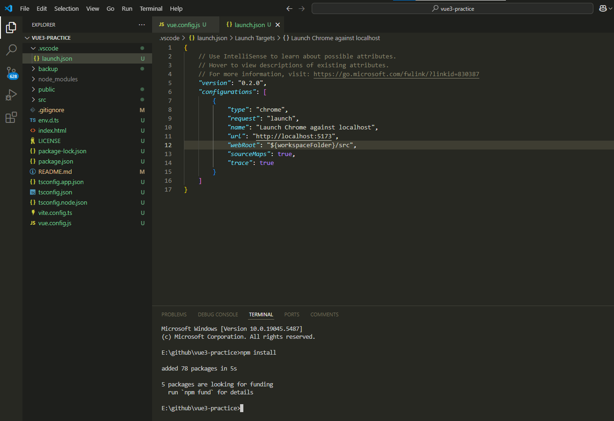
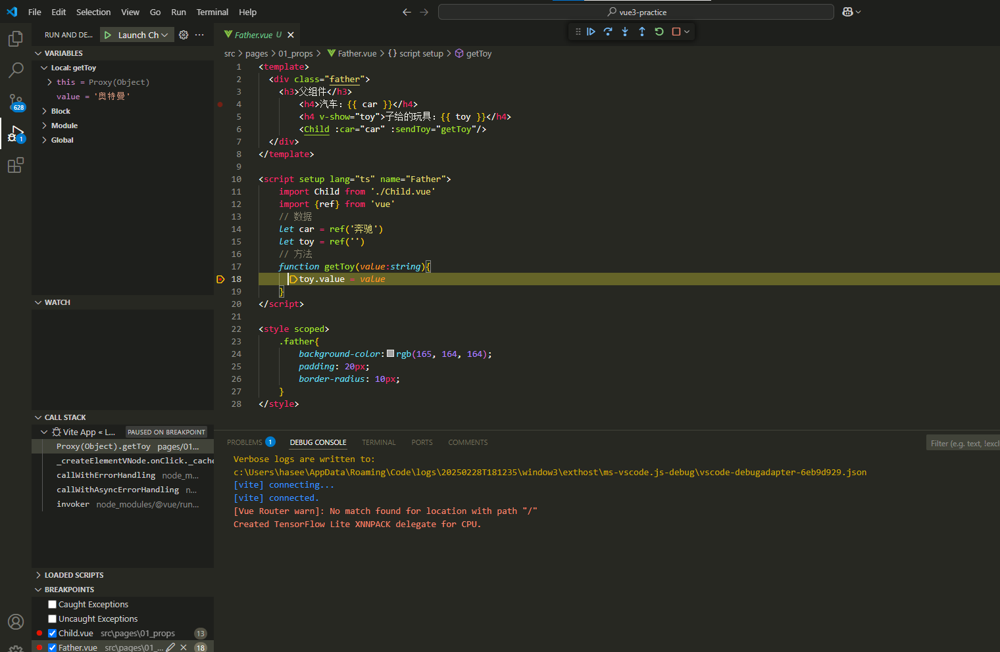
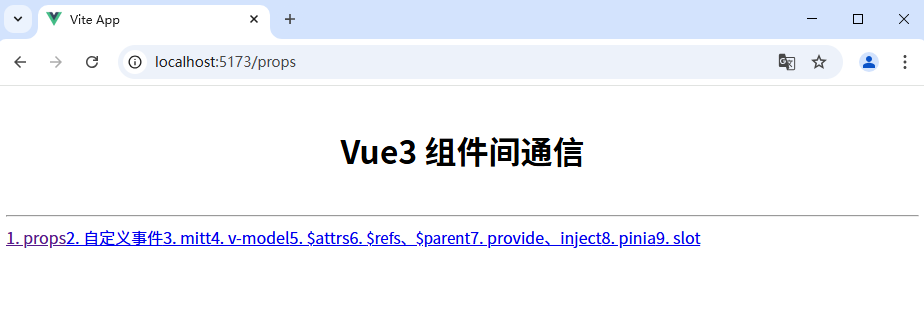

This template should help get you started developing with Vue 3 in Vite.

## Recommended IDE Setup

[VSCode](https://code.visualstudio.com/) + [Volar](https://marketplace.visualstudio.com/items?itemName=Vue.volar) (and disable Vetur).

最近插件更新为：Vue-Official

## Type Support for `.vue` Imports in TS

TypeScript cannot handle type information for `.vue` imports by default, so we replace the `tsc` CLI with `vue-tsc` for type checking. In editors, we need [Volar](https://marketplace.visualstudio.com/items?itemName=Vue.volar) to make the TypeScript language service aware of `.vue` types.

## Customize configuration

See [Vite Configuration Reference](https://vitejs.dev/config/).

## Project Setup

```sh
npm install
```

### Compile and Hot-Reload for Development

```sh
npm run dev
```

### Type-Check, Compile and Minify for Production

```sh
npm run build
```

## VSCode开启调试模式教学

首先新建vue.confg.js，开启webpack源映射source-map

```js
module.exports = {
	configureWebpack: {
		devtool: 'source-map'
	}
}

```

接下来选择Run and Debug，创建属于VSCode的launch.json配置文件


在以上source-map开启的基础上，launch.json配置文件的具体配置需要根据当前项目src目录所处的位置有以下两种情况

- scr在跟目录下如/project/src，（标准项目）
- src不在根目录下如/project/.../src

本仓库是标准项目结构/project/src，launch.json配置文件的具体配置见下文

项目结构如下：vue3-practice/src



.vscode/launch.json配置如下：

- 指定项目启动端口："url": "http://localhost:5173"
- 指定src目录位置：`"webRoot": "${workspaceFolder}/src"`,其中 `${workspaceFolder}`意味着项目根目录vue3-practice
- 开启webpack源映射source-map：`"sourceMaps": true `。这里的 `"sourceMaps": true `和vue.config.js中的 `module.exports = { configureWebpack: { devtool: 'source-map' } }` 的配置并不重复。前者是 VS Code 调试配置中的一部分，用于告诉调试器使用源映射，而后者是 Webpack 配置的一部分，用于生成源映射文件。两者共同作用，确保调试器能够正确映射到源代码。
- 在调试配置中，`"trace": true` 表示启用详细的调试日志记录。这将生成更多的调试信息，帮助你诊断和解决调试过程中遇到的问题。

```js
{
    // Use IntelliSense to learn about possible attributes.
    // Hover to view descriptions of existing attributes.
    // For more information, visit: https://go.microsoft.com/fwlink/?linkid=830387
    "version": "0.2.0",
    "configurations": [
        {
            "type": "chrome",
            "request": "launch",
            "name": "Launch Chrome against localhost",
            "url": "http://localhost:5173",
            "webRoot": "${workspaceFolder}/src",
            "sourceMaps": true,
            "trace": true
        }
    ]
}
```

首先正常启动项目

```shell
npm run dev
或者
npm run serve
```

在项目已经启动的基础上，给项目源代码适当位置打上断点，然后选择IDE左侧边栏的Debug按钮以Debug模式再次启动



同时自动弹出新的调试模式浏览器主页窗口，证明调试模式已生效


